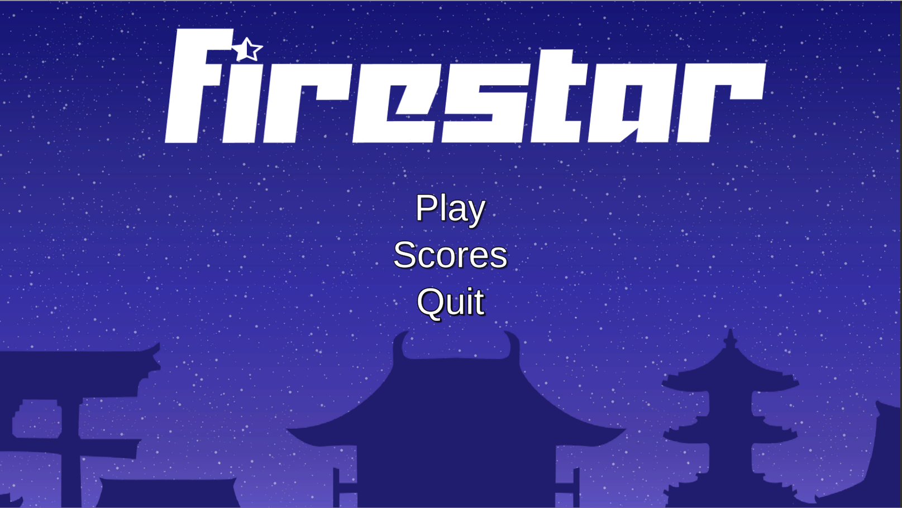
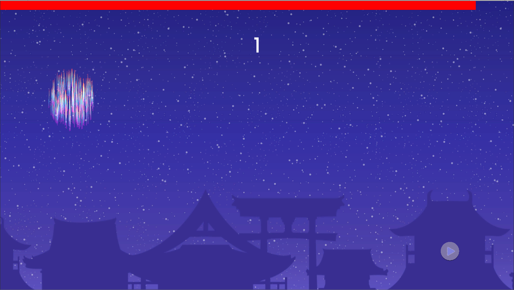
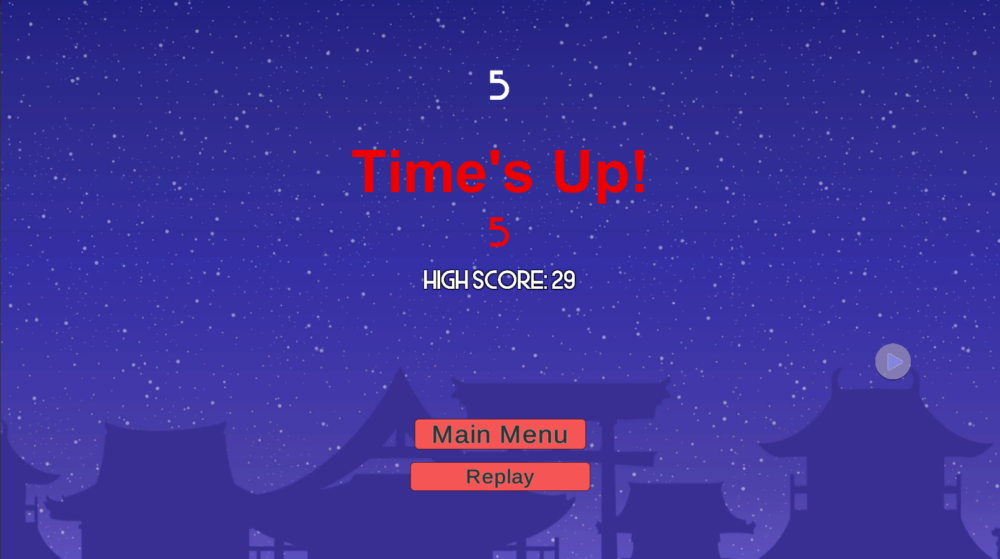

# [FireStar Game](https://simmer.io/@ohwowow/firestar?fbclid=IwAR3KMiRV9-3Dydze3BsDcFzDXZlxsXOXK4KnJNzdn_rTymm8RB8CJch1Hl4)

*Unity Reflex Tapping Game*

I used Unity and C# scripts to create a mouse clicking game that challenges the reflexes of its players by having players try and click on buttons that randomly spawn across the whole screen. I found that this game was a fun way to learn more about game development through unity and sharpen my skills with programming in C#. Below are some screenshots of the gameplay and the game itself.

## Game Screenshots

- Working Main Menu page that allows players to play the game, look at highscores in that session, and quit the game.

- The Player's goal is to press the randomly spawning buttons that spawn through the whole screen with as much precision as they can. They will gain a point for each button that they accurately press and loss a point for each button that they miss (the buttons have a short lifespan). If they press on the button, then a cool firework effect will explode around the button. They have about 30 seconds until the game is finished.

- Once the timer runs out, players can see their score and the highscore during this gaming session. They are given the option to replay the game or quit to the Main Menu.

## Contributors
- Co-developed by Giang Nguyen (www.github.com/giangvubinhn)

